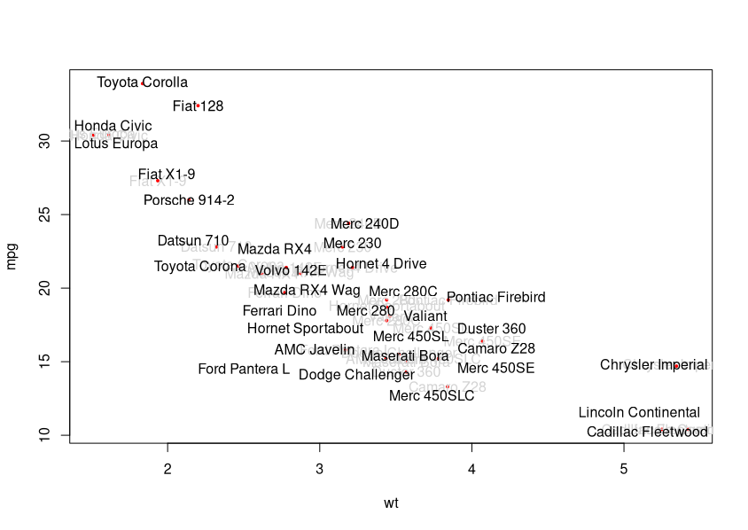

Overview
--------

`repel` helps repel overlapping text labels. It is forked from `ggrepel` to
help in a non `ggplot2` context. Work in progress.


Installation
------------

```r

# install.packages("remotes")
remotes::install_github("hms-dbmi/repel")
```

Usage
-----

```
library(repel)

# plot points
plot(mpg ~ wt, data = mtcars, pch = 19, cex=0.4, col = 'red')

# construct label_coords
label_coords <- mtcars[, c('wt', 'mpg')]
colnames(label_coords) <- c('x', 'y')
label_coords$label <- row.names(mtcars)

# get coords of repelled labels and exclude if too much overlap
repels <- repel_text(label_coords)
repels <- repels[!repels$too_many_overlaps, ]

# plot labels and segments
text(label_coords$x, label_coords$y, labels = label_coords$label, col='lightgray')
text(repels$x, repels$y, labels = repels$label)
```


